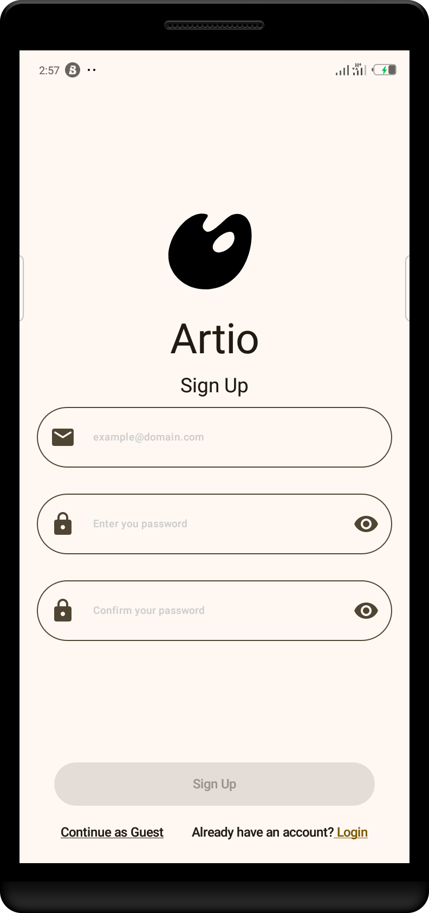
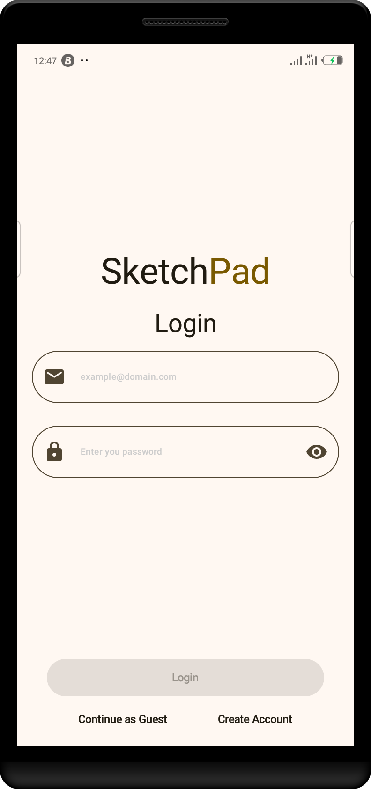
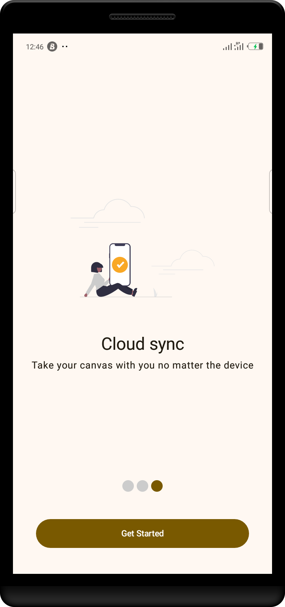
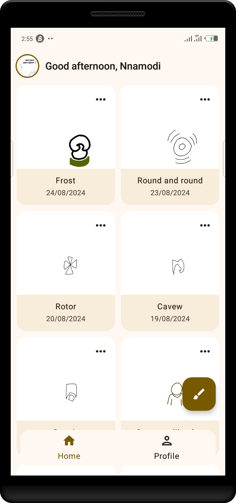
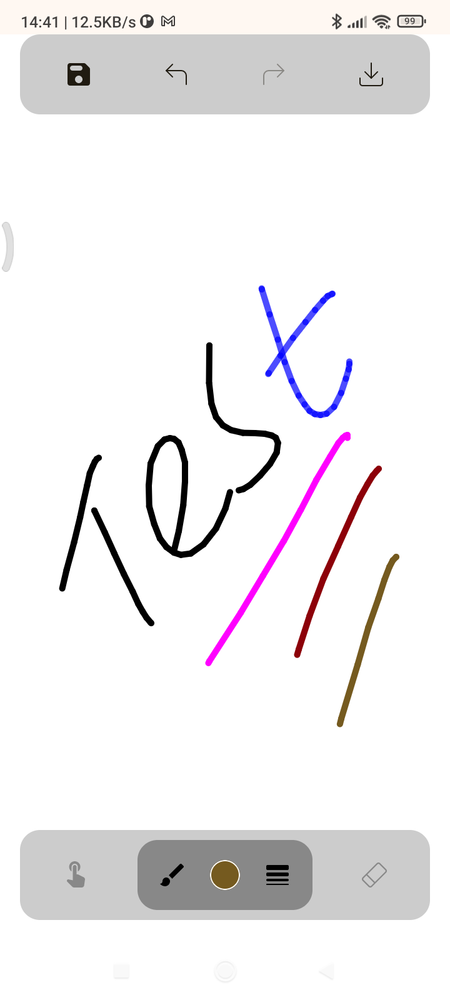
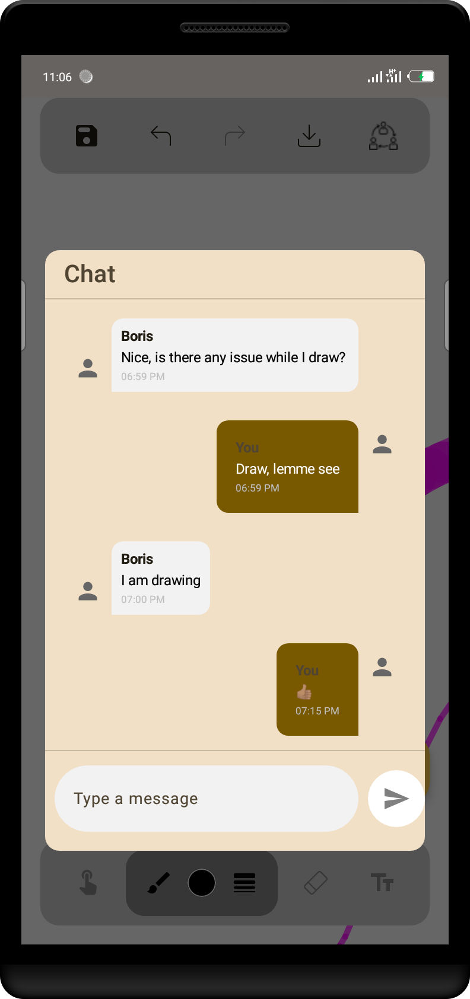
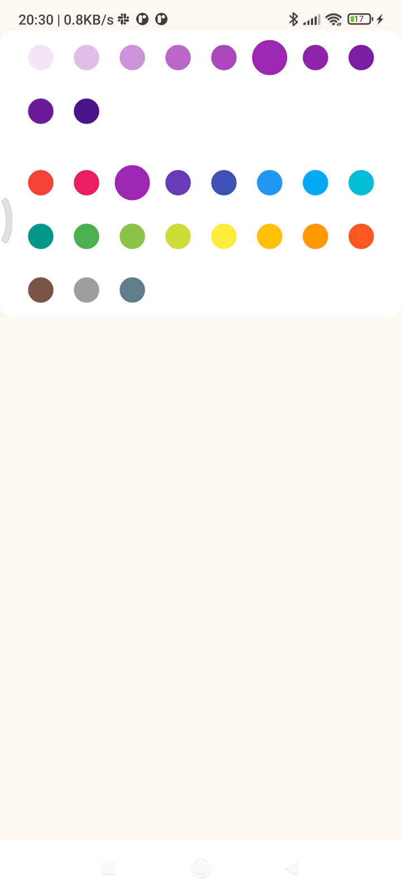
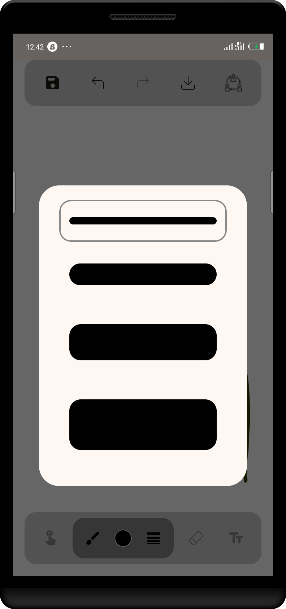
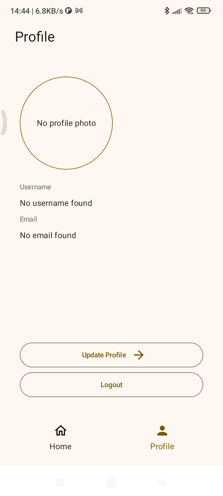
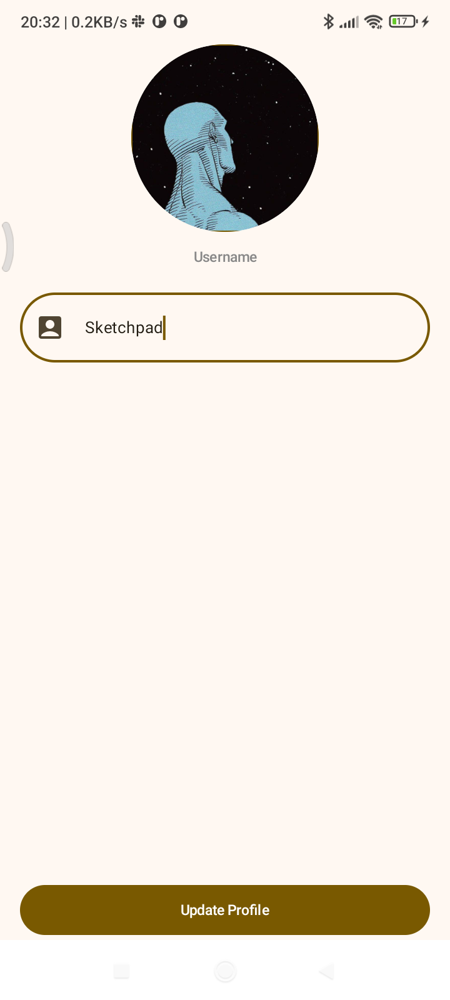

## SketchPad
A Jetpack Compose App that lets users draw on a canvas.
## Features
- Authentication
- Draw on a Canvas
- Change brush color
- Change brush size
- Include text on canvas
- Erase drawing
- Canvas Management (Update, Save and Delete)
- Local data persistence of a canvas
- Export sketches in PNG and PDF
- Cloud sync (so you never have to lose your drawings)
- Realtime collaborative drawing with chat feature

## Demo
***Explore the virtualized demonstration of the release apk version [here](https://appetize.io/app/b_iztxobblihyfqohggeteabz4bi)***

  ***Or you can install the apk from below 👇🏽***

  [](https://github.com/slowburn-404/SketchPad/releases/tag/v3.0.0)

## Technology Stack
- **[Kotlin](https://kotlinlang.org/)**: The official programming language for developing Android applications.
- **[Jetpack Compose](https://developer.android.com/develop/ui/compose)**: A modern UI toolkit for building Android applications in Kotlin.
- **[Coil](https://coil-kt.github.io/coil/)**: A lightweight image loading library.
- **[Koin](https://insert-koin.io/)**: Dependency Injection Framework.
- **[Firebase](https://firebase.google.com/)**: Backend service for authentication and photo storage.
- **[ViewModel](https://developer.android.com/topic/libraries/architecture/viewmodel)**: A lifecycle-aware Android Architecture Component for holding state.
- **[Room Persistence Library](https://developer.android.com/training/data-storage/room)**: Android Jetpack Library for local data caching.
- **[Datastore](https://developer.android.com/topic/libraries/architecture/datastore)**: Jetpack DataStore is a data storage solution that allows you store key-value pairs asynchronously.
- **[Gson](https://github.com/google/gson)**: For converting Java Objects into their JSON representation and back to Java Objects.

## Screenshots
|::::::::::::::::::::::::::::::::::::::::|::::::::::::::::::::::::::::::::::::::::|::::::::::::::::::::::::::::::::::::::::|::::::::::::::::::::::::::::::::::::::::|::::::::::::::::::::::::::::::::::::::::|::::::::::::::::::::::::::::::::::::::::|::::::::::::::::::::::::::::::::::::::::|::::::::::::::::::::::::::::::::::::::::|::::::::::::::::::::::::::::::::::::::::|::::::::::::::::::::::::::::::::::::::::|::::::::::::::::::::::::::::::::::::::::|
|:--:|:--:|:--:|:--:|:--:|:--:|:--:|:--:|:--:|:--:|:--:|
||||||||||||

## Setup Instructions

1. **Clone the repository to your local machine.**
```bash
git clone https://github.com/slowburn-404/Artio.git

cd Artio/
```
2. **Open in Android Studio**
- Open Android Studio
- Select `File` > `Open...`
```
3. **Build and run the app**
- Ensure your Android device or emulator is set up.
- Click on the `Run` button or use `Shift + F10`.

## License
This project is licensed under the Apache-2.0 License. See the [LICENSE](./LICENSE) file for more details.
https://appetize.io/app/b_rrkqtlmwbh43asyppb7hi32boy
